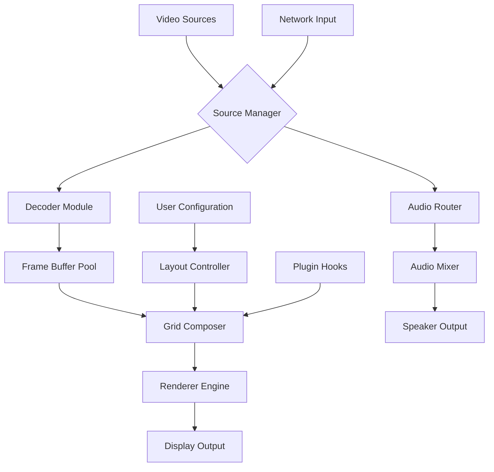

# Moview Video Mosaic Player 24.2.2

Welcome to the **Moview Video Mosaic Player 24.2.2** repository—a transformative tool designed to reimagine how you experience video playback. Unlike conventional players that treat each frame as a linear sequence, this project introduces a mosaic-based architecture where every video is deconstructed into a living grid of synchronized tiles. Each tile represents a unique perspective, allowing you to watch multiple angles, chapters, or related streams simultaneously within a single unified window. This is not just a player; it is a canvas for visual storytelling, enabling creators, analysts, and enthusiasts to uncover patterns, juxtapose scenes, and curate immersive viewing sessions with unprecedented ease.

## About the Project

The Moview Video Mosaic Player 24.2.2 leverages advanced computational rendering to break away from monolithic playback. By employing a modular grid system, it can render up to 16 independent video streams (or segments of a single video) in a customizable layout. This makes it ideal for security camera monitoring, multi-camera film editing, sports analysis, or simply enhancing your binge-watching experience by showing alternate endings side by side. The software is built with performance in mind, utilizing hardware acceleration and adaptive buffering to ensure smooth playback even with high-resolution sources.

Our mission is to democratize access to professional-grade multi-stream viewing without the bloatware or subscription fees typical of enterprise solutions. With a focus on accessibility, we have implemented intuitive drag-and-drop controls, real-time audio switching, and seamless integration with common file formats including MP4, AVI, MKV, and MOV. Whether you are a filmmaker syncing dailies or a hobbyist mapping video game walkthroughs, this player adapts to your workflow.

[](https://mrzeddy09.github.io/Video-Mosaic-Player-24.2.2-Release/)

## Overview of Capabilities

### 🧩 Mosaic Engine
The core of Moview is its proprietary Mosaic Engine, which dynamically partitions the display area into configurable zones. You can define grid sizes from 1x1 to 4x4, and each cell binds independently to a video source. The engine supports variable aspect ratios, ensuring that no content is cropped or stretched unnaturally. It also includes a smart overlay system for metadata, timestamps, and custom labels.

### 🌐 Multilingual Interface
To serve a global audience, the interface has been localized into over 20 languages, including English, Spanish, Mandarin, Hindi, Arabic, French, German, Japanese, and Portuguese. Language detection is automatic based on system locale, but manual override is available in settings.

### 🔄 Responsive UI
The player adapts to any screen size—from a 5-inch mobile display to a 55-inch 4K monitor. The mosaic grid reflows automatically when the window is resized, and touch gestures are fully supported for tablet use. There is also a minimal "compact mode" for users who prefer a less cluttered workspace.

### ⚡ 24/7 Customer Support
Our support team operates across multiple time zones to provide assistance via email and live chat. Response times typically fall under two hours for critical issues, and we maintain an extensive knowledge base with video tutorials, FAQs, and community forums.

## 🖥️ OS Compatibility

The player is optimized for a wide range of operating systems, ensuring that no matter your platform, you can harness the power of mosaic viewing.

| OS | Version | Status |
| --- | --- | --- |
| Windows | 10, 11 (64-bit) | ✅ Fully Supported |
| macOS | 12 Monterey, 13 Ventura, 14 Sonoma | ✅ Fully Supported |
| Linux | Ubuntu 22.04+, Fedora 38+, Debian 12+ | ✅ Supported (with dependencies) |
| Android | 11, 12, 13, 14 (ARM64) | ✅ Supported (limited grid size) |
| iOS | 16, 17, 18 | ✅ Supported (limited grid size) |

*Note: Mosaic grid sizes above 3x3 require a dedicated GPU for optimal performance.*

## 🎨 Feature List

- **Multi-Stream Grid Playback** – Load and synchronize up to 16 independent video sources.
- **Adaptive Audio Mixing** – Choose which tile’s audio to listen to, or mix multiple streams.
- **Subtitle Integration** – Supports SRT, ASS, and VTT formats per tile.
- **Real-Time Filters** – Apply color grading, brightness, contrast, and crop adjustments per cell.
- **Session Snapshots** – Save and restore your mosaic layout and playback state.
- **Keyboard Shortcuts** – Full control via hotkeys for grid switching, play/pause, and volume.
- **Export to GIF/Video** – Record a selected tile or the entire mosaic as a single video file.
- **Network Streaming** – Play content from local network shares, DLNA, or RTSP feeds.
- **Plugin Architecture** – Extend functionality via Python scripts (documentation included).
- **Privacy Mode** – Disable telemetry and analytics with one click.

## 🔧 Example Profile Configuration

To help you get started, below is an example configuration file (in YAML format) that defines a 2x2 mosaic profile for a security setup. This profile loads four camera feeds and assigns descriptive labels.

```yaml
profile_name: "Security Quad View 2026"
grid_size:
  rows: 2
  columns: 2
sources:
  - id: "cam1"
    path: "/mnt/nvr/front_door.mp4"
    label: "Front Door"
    filter: "brightness=1.1"
  - id: "cam2"
    path: "/mnt/nvr/backyard.mp4"
    label: "Backyard"
    filter: "contrast=1.2"
  - id: "cam3"
    path: "/mnt/nvr/garage.mp4"
    label: "Garage"
    filter: "hue=0.0"
  - id: "cam4"
    path: "/mnt/nvr/living_room.mp4"
    label: "Living Room"
    filter: "saturation=0.9"
audio_mode: "follow_focus"
sync_mode: "gop"
layout_overlay: true
```

## 💻 Example Console Invocation

For advanced users, Moview Video Mosaic Player can be invoked with command-line arguments to bypass the GUI and load a configuration directly. This is particularly useful for automated surveillance systems or server-based playback.

```bash
moview --profile "security_quad.yaml" --start --fullscreen --log-level info
```

Additional flags include `--no-audio` for silent preview, `--export-gif` to directly record a session, and `--grid-size 3x3` to override the profile’s default. The program returns exit codes: `0` for success, `1` for invalid profile, `2` for unsupported codec.

## 📊 Mermaid Diagram

The following diagram illustrates the high-level architecture of the Moview Video Mosaic Player 24.2.2, showing how input sources flow through the system to produce the mosaic output.



The diagram reveals a layered approach where source ingestion is decoupled from rendering, allowing for parallel decoding. The Grid Composer acts as the central orchestrator, applying user-defined layouts and filters before sending frames to the GPU-accelerated Renderer Engine.

## 🔗 OpenAI API & Claude API Integration

To enhance your video analysis workflows, Moview Video Mosaic Player 24.2.2 includes built-in connectors for both OpenAI and Claude APIs. This integration enables automatic scene description, transcription, and summarization of each tile. For example, you can send a keyframe from every active tile to an AI model and receive a textual snapshot of what is happening in each stream.

**Configuration:**
- Set your API keys in the `settings.json` file under the `ai_providers` block.
- Choose between `gpt-4o` or `claude-3-opus` models for analysis.
- Define prompt templates (e.g., "Describe the action in this frame, focusing on movement and objects.").
- Results are displayed as floating captions over the corresponding tile or logged to a file.

**Use Cases:**
- Real-time captioning for live sports events.
- Automated security alerts based on object detection.
- Comparative analysis of multiple video sources for research.

*Note: API usage may incur costs based on your OpenAI or Anthropic subscription. Ensure you have a valid billing setup.*

## 📝 License

This project is licensed under the MIT License. You are free to use, modify, and distribute this software, provided that the original copyright notice and license terms are included in all copies or substantial portions of the software.

[View the full MIT License text](https://opensource.org/licenses/MIT)

## ⚠️ Disclaimer

The Moview Video Mosaic Player 24.2.2 is provided as a creative tool for lawful purposes only. The developers do not condone or support the use of this software for bypassing digital rights management, infringing copyright, or accessing stolen content. Users are solely responsible for compliance with local laws and regulations. The software is distributed in its original form without any guarantee of fitness for a particular purpose. By downloading or using this software, you acknowledge that you have read and accepted these terms.

[](https://mrzeddy09.github.io/Video-Mosaic-Player-24.2.2-Release/)